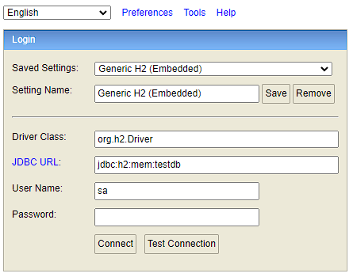
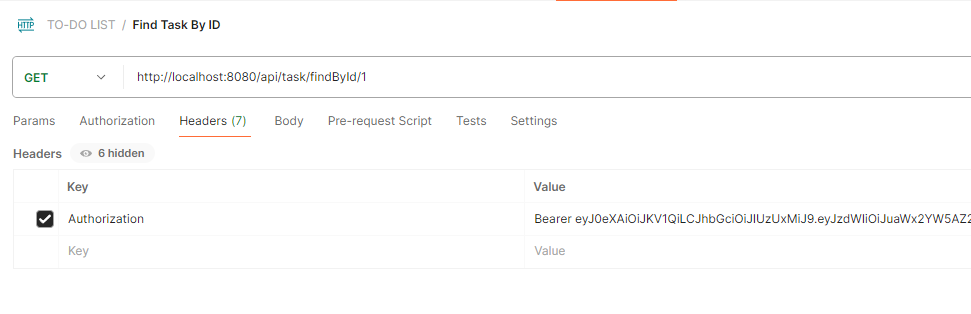

# TO-DO TASKS
- Sistema para gerenciamento de tarefas.

#Ao iniciar o projeto, será iniciado também o banco de dados H2 no seguinte endereço: http://localhost:8080/h2-console/

#Como utilizar o serviço:
Está disponível uma collction do postman para efetuar consultas nos endpoints da aplicação:

#  Link para a collection do Postman:
[TO-DO LIST.postman_collection2.json](..%2F..%2FDesktop%2FTO-DO%20LIST.postman_collection2.json)
OBS: Efetuar o import desse arquivo no postman!

# 1 - Utilizar um serviço
— Existem dois endpoins que o usuário pode utilizar sem estar autenticado, que são:
POST/http://localhost:8080/api/user/create
POST/http://localhost:8080/login
Para utilizar todos os outros endpoints da aplicação, o usuário precisa estar autenticado!

- Você pode criar um novo usuário para fazer login na aplicação, ou utilizar um usuário que já sobe por padrão na aplicação, esse user está citado abaixo!

CURL para efetuar o login:
curl --location 'http://localhost:8080/login' \
--header 'Content-Type: application/json' \
--data-raw '{
"email":"admin@gmail.com",
"password":"123"
}'

OBS: Login é feito com email e password.

Esse serviço retornará um token para que você possa utilizar as outras rotas, você deverá informá-lo da seguinte forma:

OBS: Sempre inserir a palavra "Bearer" antes do token, ex "Bearer eyJ0eXAiOiJKV1QiLCJhbGciOiJIUzUxMiJ9"